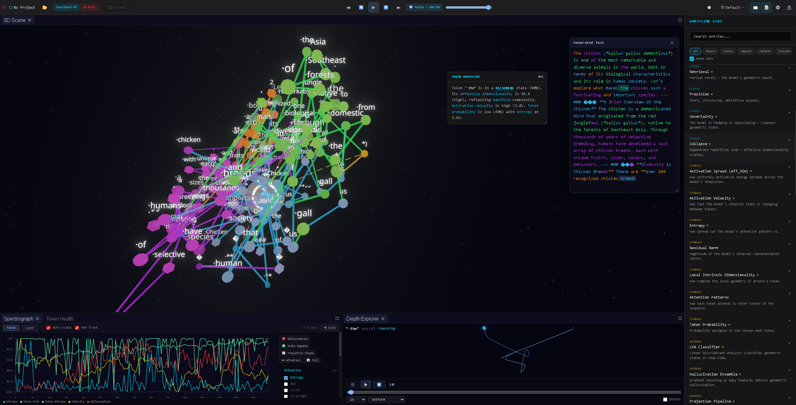

# GHOSTLINE

**Geometric Hierarchies Organizing State Transitions: Linear Insights in Neural Execution**

Real-time behavioral monitoring for transformer inference.

[](https://ghostline-research.org)
[](LICENSE)
[](https://github.com/DisasterGhost/GhostLine-Demo/actions/workflows/deploy.yml)
[](https://ghostline-research.org)



---

## What is GhostLine?

GhostLine reads the geometry of transformer activations during inference to classify behavioral states, detect hallucination, and intervene on model behavior — in real time.

This demo viewer lets you explore pre-recorded Qwen3-8B sessions with full geometric data. No GPU or backend required.

## How it works

1. **Capture** — Hook into transformer layers during generation, extract per-token hidden states
2. **Project** — PCA → LDA → Supervised Contrastive Linear (SCL) projection to 3D (90 parameters per layer, r=0.99 fidelity)
3. **Classify** — The projection coordinates ARE behavioral state coordinates. The projector is simultaneously a classifier.
4. **Visualize** — 3D trajectory, spectrograph, signal explorer, token health, and research tools in one instrument surface

## Key results

| Capability | Result |
|------------|--------|
| State classification | 94.8% accuracy (8B, 5 states) |
| Fabrication detection | F1 0.94 (3-class, held-out stress test) |
| Cross-architecture | 4 families validated (Llama, Qwen, Gemma, Pythia) |
| Causal intervention | 9 geometric nudges broke a deterministic collapse loop |
| Projection method | 90 params/layer, 100x faster than UMAP |

## Recordings

| Recording | What it shows |
|-----------|---------------|
| How AI Thinks About AI | All cognitive states in one generation — intro to GhostLine |
| Mathematical Reasoning | Reasoning and precision alternate with every equation symbol |
| Knowledge Retrieval | 5 states, 63 transitions, widest entropy range |
| Moral Reasoning | Uncertainty-dominant — the model exploring without pretending to know |
| Code Generation | Code synthesis with structured precision geometry |
| Hallucination Detection | Fabrication vs factual output, geometric signatures visible |

## Run locally

```bash
npm install
npm run dev
```

Opens at `http://localhost:5173/`.

## Controls

| Key | Action |
|-----|--------|
| Space | Play / pause |
| Arrow keys | Step forward / back one token |
| Click token | Inspect geometry in Token Inspector |
| Layer selector | Switch between captured layers (L0–L31) |

## Tech stack

React 19, TypeScript 5.9, Three.js (React Three Fiber), Vite 7

## Intellectual property

4 US provisional patents filed covering the full stack — signal extraction, classification intelligence, the spectrographic interface paradigm, and introspective inference training. 27 claims in the P3 filing (US 63/982,900, Feb 13, 2026); P4 filed Apr 2026 (US 64/039,169).

## Contact

Collin Civish — [collin@ghostline-research.org](mailto:collin@ghostline-research.org) | [@DisasterGh0st](https://x.com/DisasterGh0st)

## License

[MIT](LICENSE)
